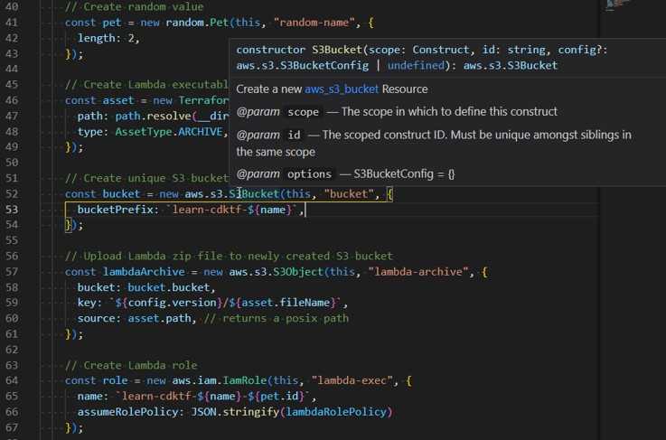

<!-- _class: titleslide -->

 
 
 
 

# CDK

L'infrastructure-as-code avec son langage favori

Olivier JACQUES
AWS ProServe

<!-- 

-->

---

Les façons de provisionner de l'infrastructure

* **Manuel** : Documents Word, Wikis, demande-a-robert-il-l'a-déjà-fait
* **Scripté** : `#!/bin/bash`
* **Déclaratif** : CloudFormation, Terraform
* **Générateurs** : Troposphere, GoFormation
* **Abstractions** : AWS CDK, Pulumi

<!-- 

-->

---

<!-- _class: titleslide -->

# AWS Cloud Development Kit

---

Programmez l'infrastructure en Python, Typescript, Javascript, Java, C#, Go

---

# 3 projets

* AWS CDK
* CDK for Terraform
* Cloud Development Kit for Kubernetes - CDK8s

Tous basés sur JSSI

---

# 3 cycles

* [`Python, TS, JS, Java, C#, Go`] => **AWS CDK** => CloudFormation
* [`Python, TS, JS, Java, C#, Go`] => **CDKTF** => Terraform HCL
* [`Python, TS, JS, Java, C#, Go`] => **CDK8s** => Kubernetes manifests

---

# 6 GIT commands

* `git branch my_new_feature`
* `git add .`
* `git commit -m "New: AWS RDS infrastructure is now managed as code"`
* `git push -u origin my_new_feature`
* `git checkout main`
* `git pull`

---

# Séquence

* 📘 `cdktf init`
* 🛠️ `npm run build`
* 🏭 `cdktf synth`
* 🔍 `cdktf diff`
* 🚀 `cdktf deploy`

---

<!-- _class: titleslide -->

# Merci

🐤 @ojacques2
