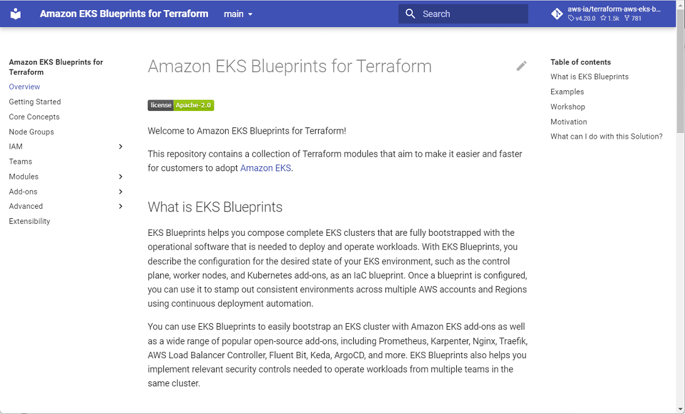
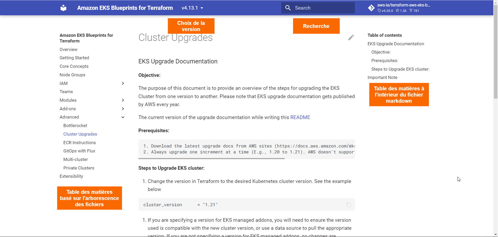
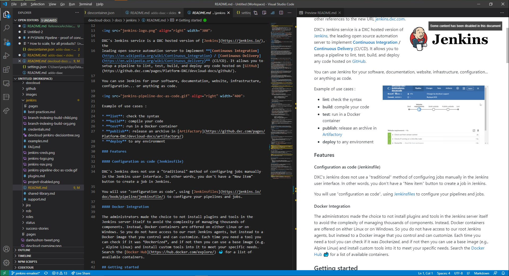
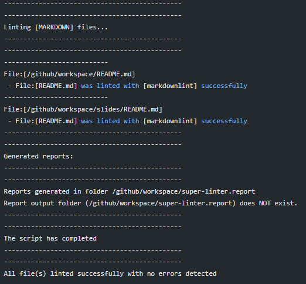
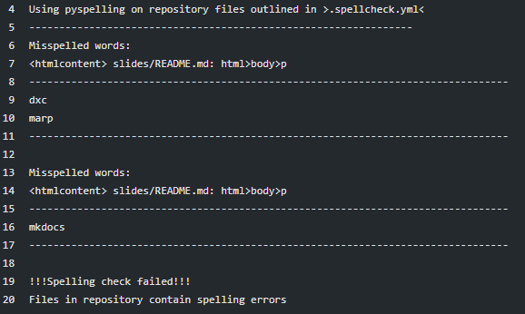
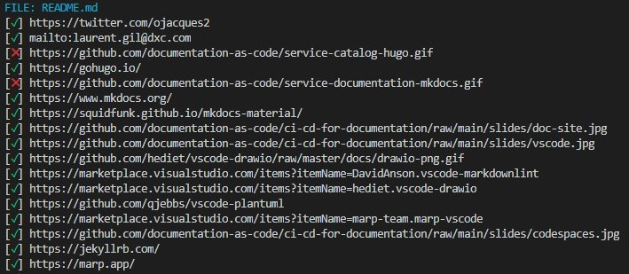
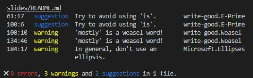
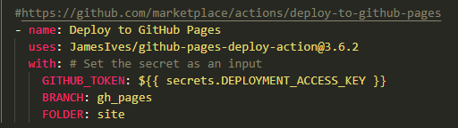

<!-- _class: titleslide -->

# La documentation "comme du code"

...ou utiliser la même discipline pour notre documentation que pour notre code

---

# Documentation : La quête de la perfection

# 🏰🦄🤴👸🐴👻⚔🗡🏴‍☠️

---

# 🤯 "Comme du code"

* La documentation est un produit
* Gestion en version avec Git
* Collaboration via les pull requests
* CI/CD: tester et publier automatiquement

---

# Documentation technique
Avec [MkDocs](https://www.mkdocs.org/) +
[material theme](https://squidfunk.github.io/mkdocs-material/)

---

---

<!-- _class: titleslide -->

# En pratique

---

# Ecrire le texte

Utilisation de [`Markdown`](https://guides.github.com/features/mastering-markdown/)

Avec votre éditeur préféré :

- [VSCode](https://code.visualstudio.com/docs/languages/markdown) 👈
- [IntelliJ](https://www.jetbrains.com/help/idea/markdown.html#navigation)
- Eclipse

---

# Ecrire le texte (2)

## Rajouter des extensions

- [markdownlint](https://marketplace.visualstudio.com/items?itemName=DavidAnson.vscode-markdownlint) (pour la syntaxe)
- [Draw.io](https://marketplace.visualstudio.com/items?itemName=hediet.vscode-drawio) (pour les schémas)
- [PlantUML](https://github.com/qjebbs/vscode-plantuml) (pour les schémas comme du code)
- [Marp](https://marketplace.visualstudio.com/items?itemName=marp-team.marp-vscode) (pour les transparents)

---
# Outillage et frameworks

- [Jekyll](https://jekyllrb.com/) 🤐
- [Hugo](https://gohugo.io/): puissant, léger, rapide 👈
- [Marp](https://marp.app/), [sli.dev](https://sli.dev): transparents / présentations
- [MkDocs](https://www.mkdocs.org/) + [material theme](https://squidfunk.github.io/mkdocs-material/) 👈

---
# CI: Linter - vérifier le markdown

## CLI linter

- [github super-linter](https://github.com/github/super-linter)
- [markdownlint](https://github.com/DavidAnson/markdownlint)

## Linter dans l'éditeur

- [VS Code markdownlint extension](https://marketplace.visualstudio.com/items?itemName=DavidAnson.vscode-markdownlint)

---

# CI: Orthographe

## En ligne de commande

- [spellcheck-github-actions](https://github.com/rojopolis/spellcheck-github-actions)
- [spellchecker-cli](https://github.com/tbroadley/spellchecker-cli)

## Dans l'éditeur

- [VS Code code-spell-checker extension](https://marketplace.visualstudio.com/items?itemName=streetsidesoftware.code-spell-checker)

---
# CI: Vérification liens hypertexte

## Liens morts

[markdown-link-check](https://github.com/tcort/markdown-link-check)

---

# CI: Tester

## Style / voix

[Vale](https://github.com/errata-ai/vale)

---
# Publication (CD)

## Formats

HTML | PDF | DOCX | EPUB | MOBI | ...

## Hébergement web

- [GitHub pages](https://pages.github.com/) 👈
- [GitLab pages](https://docs.gitlab.com/ee/user/project/pages/)
- [Netlify](https://www.netlify.com/)
- Un bucket AWS S3 👈

---
<!-- _class: titleslide -->

# Merci 🙏

 

(Contenu préparé avec Laurent Gil)
