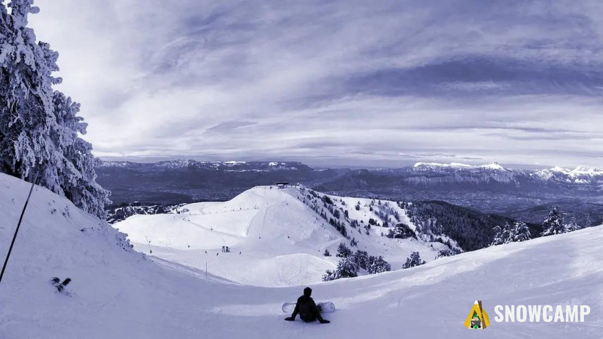

<!-- _class: titleslide -->

# Platform Engineering

## Lorsque Kubernetes devient la clé du royaume

Laurent Gil - ATOS  
Olivier Jacques - AWS

<!--
Intro:
Bonjour à tous. Et merci d'être venu à notre conférence sur le Platform Engineering et Kubernetes.

Mais Laurent et moi on se pose la question:

-->

---

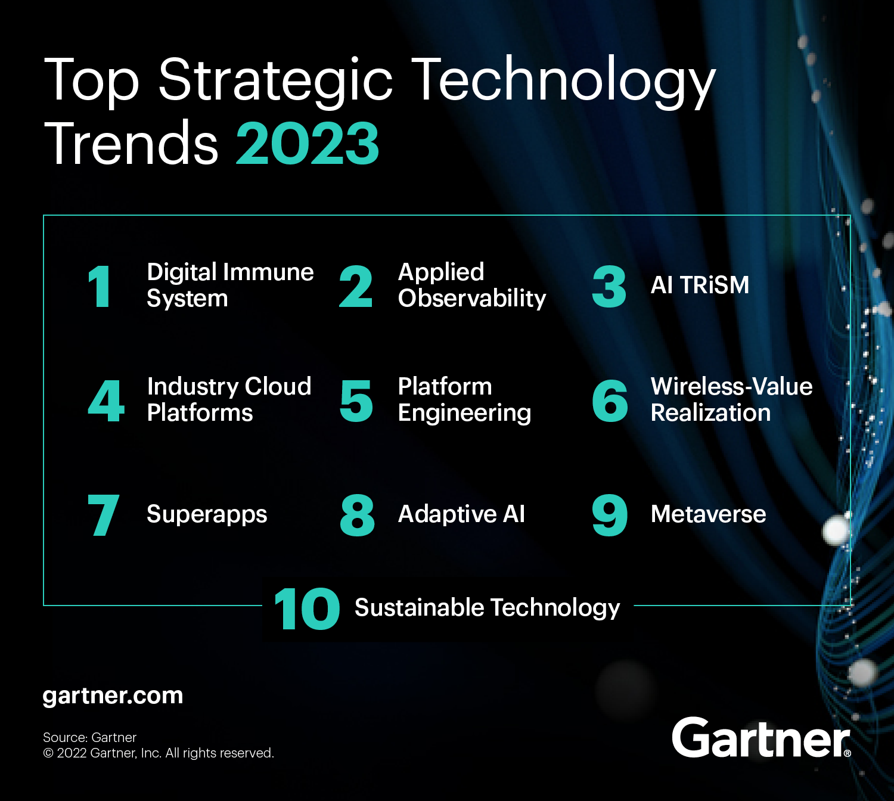

<!--
Vous êtes venus parceque que vous avez vu que Platform Engineering fait partie des tendances technologiques 2023, d'après Gartner ?
-->

---

<!-- markdown-link-check-disable -->
# Cycle de l'effervescence [Gartner](https://www.gartner.com/interactive/hc/4017202)
<!-- markdown-link-check-enable -->

<!--
Vous êtes venus parceque que vous avez vu que le Platform Engineering faisait partie des pratiques au tout début de leur vie sur le cycle de l'efferscence Gartner ?
-->

---

# DevOps est ☠️ ?

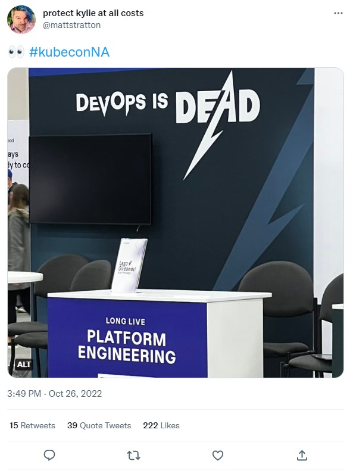

<!--
Ou même, vous avez vu passer dans votre fil d'actualité que DevOps était mort, et comme votre titre sur votre badge est "DevOps", vous vous demandez par quoi vous allez le remplacer.

-->

---

<!-- markdown-link-check-disable -->
## [Laurent GIL](https://www.linkedin.com/in/laurent-gil/)
<!-- markdown-link-check-enable -->

DevOps Coach,
AWS Solution Architect,
Kubernetes evangelist

<!-- markdown-link-check-disable -->
## [Olivier JACQUES](https://www.linkedin.com/in/olivierjacques/)
<!-- markdown-link-check-enable -->

Sr Cloud & DevOps Architect

<!--
Si vous vous posez ces questions, et bien vous êtes dans la bonne salle. Aujourd'hui, Laurent et moi même allons vous parler de l'ingénierie de plateformes (platform engineering), et comment et pourquoi Kubernetes peut fournir de solides fondations.

Je m'appelle Olivier Jacques, et je suis architecte Cloud & DevOps à AWS.
Je m'appelle Laurent Gil, ...

Laurent et moi, nous avons participé à la construction de plateformes, Laurent continue à le faire à Atos, et moi-même j'aide les clients d'AWS à construire leur propre plateforme. La plus grosse que nous ayons construit accueillait jusqu'à 30,000 builders et consistait à leur fournir tout ce qu'il faut pour définir, développer, tester, déployer et opérer les applications de notre entreprise. Cette plateforme - qui nous survécu puisque nous avons quitté l'entreprise depuis - comportait du Kubernetes, mais pas que. Et nous aurons l'occasion d'en reparler tout au long de cette présentation, car, il s'agit bien ici d'un retour d'expérience, et de convictions forgées au fur et à mesure depuis 2017.
-->

---

# Conclusion

(oui, autant partir sur la conclusion)

- Non, DevOps n'est pas mort
- Le Platform Engineering permet d'accélérer l'innovation
- Kubernetes comme plateforme de base

---

<!-- _class: dividerslide -->
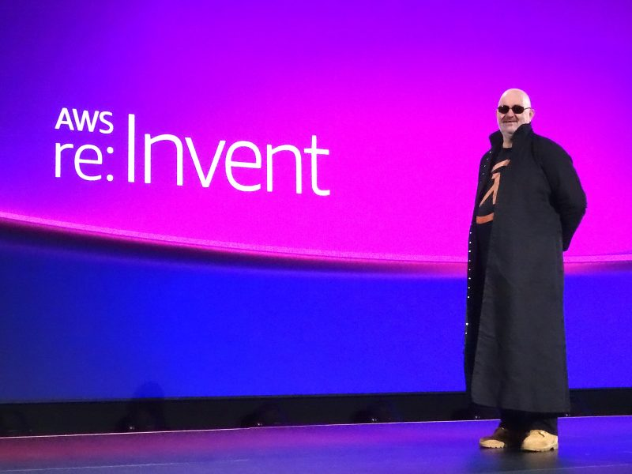

       

# "You build it, you run it"
## (Tu le crées, tu l'opères)
## 2016, Dr Werner Vogels, CTO AWS

<!-- 
Je voulais remettre ici cette citation de Dr Werner Vogels, CTO d'AWS. "You Build it, you run it". C'est important, car c'est comme cela que nous opérons à AWS. Cela dit, tout n'est pas dit dans ces 6 mots. Pour opérer ainsi, les ingénieurs d'AWS ont besoin de plateformes. Pour construire et opérer les plus de 200 services distincts que compose AWS à ce jour, notre plateforme est bien évidemment AWS lui-même. Mais pas seulement. Nous avons aussi des plateformes construites au dessus d'AWS, par nos équipes, pour améliorer la productivité de nos équipes, standardiser, sécuriser, éviter de ré-inventer la roue, et surtout innover du mieux suivant ce que nos clients nous demandent. Et c'est là que le Platform Engineering entre en jeu.
-->

---

# "You build it, you run it" - cela veut dire quoi ?

---

# 2 pizzas pour une équipe

---

# 2 pizzas pour une équipe

---

# 2 pizzas pour une équipe

---

# Solution ?

---

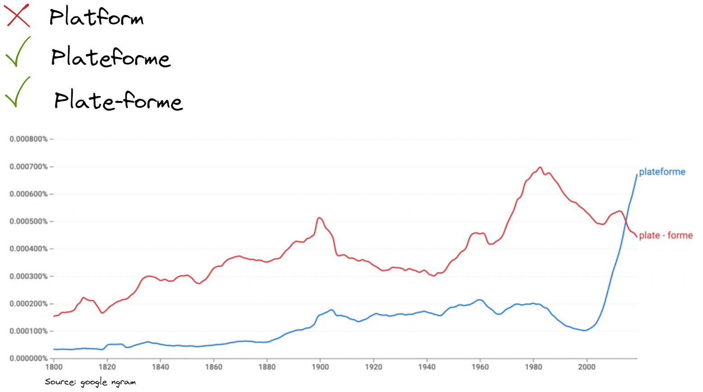

---

# Les plateformes

<!--
Les plateformes ne sont pas nouvelles. Par exemple, dans le monde de l'automobile, les plateformes ont révolutionné la façon dont les constructeurs automobiles développent et commercialisent leurs véhicules.
Volkswagen a lancé sa plateforme MQB en 2012. Cette plateforme a permis à Volkswagen de réduire le temps de développement de ses véhicules de 30% et de réduire les coûts de développement de 20%.

Nous devons pouvoir utiliser ce concept dans le monde du cloud. Sauf que... voyons la suite.
-->

---

# Définition - Plateforme

> "Les plateformes sont un moyen de centraliser l'expertise, tout en décentralisant l'innovation au client ou l'utilisateur"

Peter Gillard-Moss, ThoughtWorks

---

# Définition - Platform Engineering

> L'ingénierie des plateformes est la discipline qui consiste à concevoir et à créer des chaînes d'outils et des flux de travail qui permettent aux organisations d'ingénierie logicielle de disposer de capacités en libre-service à l'ère du "cloud-native". Les ingénieurs de plateforme fournissent un produit intégré, souvent appelé "*plateforme interne de développement*", qui couvre les besoins opérationnels de l'ensemble du cycle de vie d'une application.

[Luca Galante, platformengineering.org](https://platformengineering.org/blog/what-is-platform-engineering)

---

# Pourquoi construire une plateforme ?

- Réduire la charge cognitive
- Augmenter la productivité
- Forcer la standardisation

> Grandir les équipes, tout en préservant ce qui permet d'être productif: l'autonomie, avec un minimum de coordination et de l'infrastructure en self-service.

<!--
Les standards ne réduisent pas la créativité, mais ils la boostent. Se mettre d'accord sur certains standards permet de booster la créativité.
-->

---

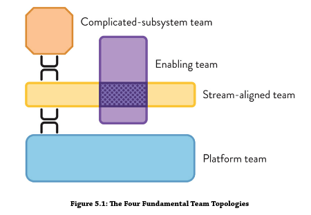
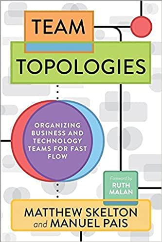

---

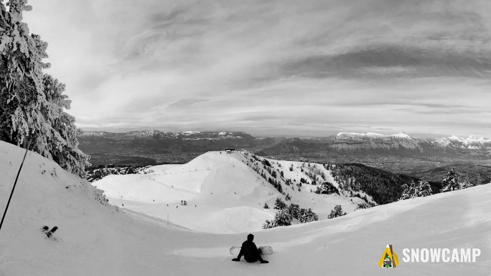

<!-- _class: titleslide -->
# Réussir une plateforme

---

# Caractéristiques d'une bonne plateforme

- Des utilisateurs !
- Facile à adopter
- Transparente dans sa gouvernance, son fonctionnement
- Responsabilité partagée (Inner Source)
- Flexible et extensible

---

# Un service

---

# Une plateforme

  
⚠️ Une plateforme n'est pas un service

> Fournir une base de donnée "clé en main", n'est pas fournir une plateforme. C'est fournir un service.

---

<!-- _class: titleslide -->
# Construire une plateforme
## avec Kubernetes

---

# A propos de Kubernetes

📖 Kubernetes est une plateforme open source extensible et portable pour la gestion de charges de travail (workloads) et de services conteneurisés📖

📖 Kubernetes a également été conçu pour servir de *plateforme* et favoriser la construction d’un écosystème de composants et d’outils facilitant le déploiement, la mise à l’échelle et la gestion des applications.📖

[source](https://kubernetes.io/fr/docs/concepts/overview/what-is-kubernetes/)

---

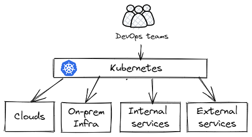

# Kubernetes comme plateforme framework

<!--
!!!! - Permet de changer le paradigme de pipeline (push pipeline devient pull pipeline) !!!!
- Bénéficie d'un écosystème très large permettant le monitoring, l'observabilité, la sécurité

-->

- Possède des qualités intrinsèques tel que
  - self service avec ses APIs
  - self-healing
  - robustness
- Simple d'utilisation grace à une approche déclarative
- Extensible par nature avec les controlleurs et les définitions de ressource personnalisé

---

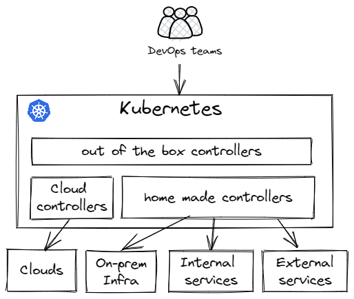

# Qu'est ce qu'un controlleur Kubernetes

**Un controlleur traque un type de ressource définissant un état souhaité afin de faire converger la plateform vers cet état.**

<!--
Et si les ressources étaient de type infrastructure ou encore des applications internes à l'entreprise.
-->

---

<!--
Présentation de l'écosystème qui fait de k8s un outil de choix pour réaliser une plateformz
-->
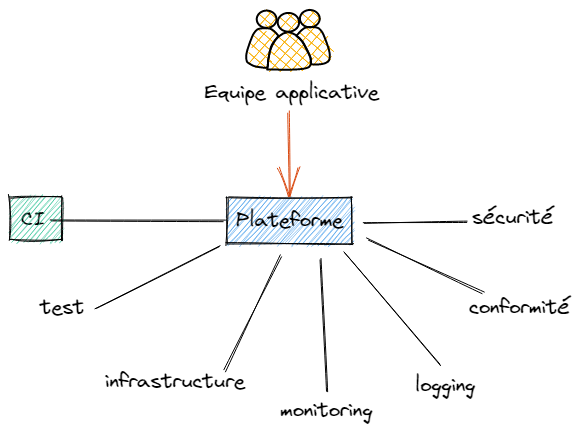

# Pour la CI / CD

- CI
  - [JenkinsX](https://jenkins-x.io/)
  - [Tekton](https://tekton.dev/)
- CD
  - [ArgoCD](https://argo-cd.readthedocs.io/en/stable/)
  - [Flux](https://fluxcd.io/)

---

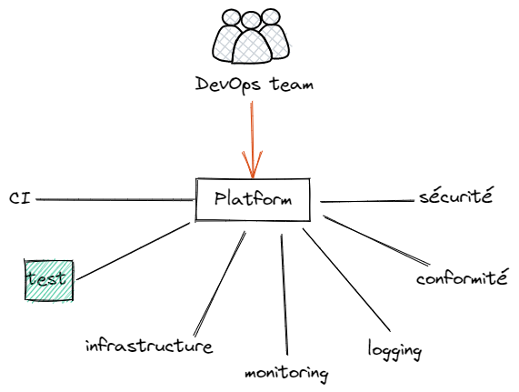

# Pour les tests

- kubernetes cluster virtuel (nodes et network partagés entre cluster physique et virtuel)
- Créer et détruire des environnements de test à la volée

---

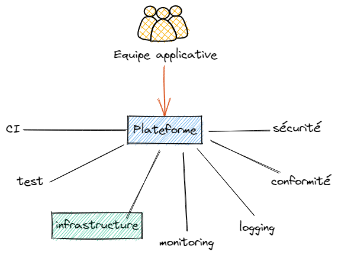

# Pour gérer l'infrastructure

- [Crossplane](https://www.crossplane.io/)
- [AWS ACK Controller](https://aws.amazon.com/fr/blogs/containers/aws-controllers-for-kubernetes-ack/)
- [GCP Config Connector](https://cloud.google.com/config-connector/docs/overview)

---

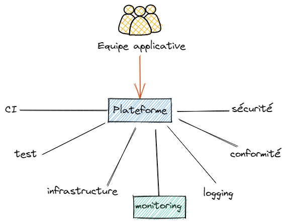

# Monitoring des applications

- [Opentelemetry](https://opentelemetry.io/)
- [Grafana](https://github.com/grafana/grafana)
- [Dynatrace](https://www.dynatrace.com/)
- [Datadog](https://www.datadoghq.com/)

---

# Collecter les log de manière centrale

- [Fluentd](https://github.com/fluent/fluentd)
- [Loggie](https://github.com/loggie-io/loggie)

---

# Gestion centralisée de la conformité

<!-- Réalisé au niveau de l'API via des webhooks -->

Instrumenter la stack Kubernetes pour forcer la conformité :

- [OPA Gatekeeper](https://github.com/open-policy-agent/gatekeeper) ([policy library](https://open-policy-agent.github.io/gatekeeper-library/website/allowedrepos))

- [Kyverno](https://github.com/kyverno/kyverno) ([policy library](https://kyverno.io/policies/?policytypes=Deployment))

---

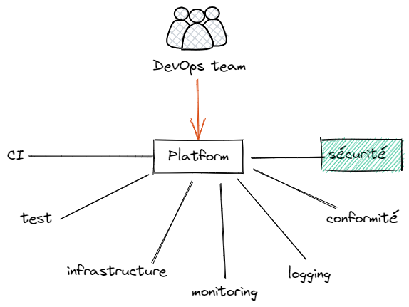

# Gestion centralisée de la sécurité

- [KubeArmor](https://github.com/kubearmor/kubearmor) : at the system level
- [Trivy-Operator](https://github.com/aquasecurity/trivy-operator)
  
---

<!-- _class: titleslide -->

# Bénéfices d'une plateforme

---

# Facilité d'intégration avec des outils internes

- Créer des définitions de ressource personnalisées
- Créer des controlleurs personnalisées permettant de piloter des outils internes

<!--
(ex: renseigner une base de référence d'application à partir de resources de type déploiment) 
-->

---

# Opérabilité

- Une seul language pour gérer une multitude de problèmes (infrastructure, application, monitoring ...)
- Une CLI commune à toutes les applications pour la recherche de problèmes
- Des fonctionnalités standards utilisés par toutes les équipes
- Portables à travers les clouds providers

---

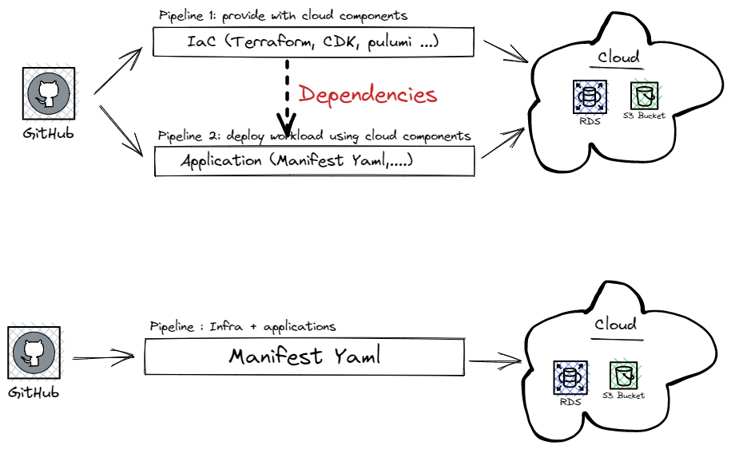

# Améliorer le temps de reprise après sinistre (MTTR)

<!--

## Habituellement
 
- Cycle de vie infra séparé du cycle de vie de l'application
- Packagé séparément
- Utilise des languages différents => charge cognitive
- Dépendance entre pipeline (ex: storage, database, DNS,...)
- un pipeline pour l'infrastructure
- un pipeline pour l'applications

## Avec Kubernetes comme plateforme

- K8s et sa capacité à être étendu via des controlleurs
  résoud ces problèmes.
- un seul pipeline pour l'**infrastructure + application**.
- atomicité du déploiement
- **universal control plane**

-->

---

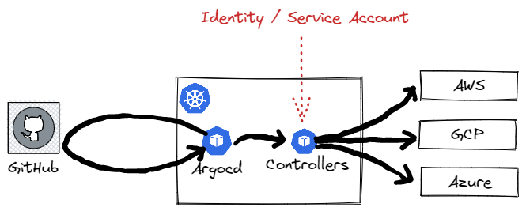

# Passer des pipelines push au pull

<!--
- sécurité:
-   Sur un pipeline push les agents de l'orchestrateur ont souvent des droits étendus. Sur un pipeline pull, c'est l'environnement cible qui a des droits sur la CI.
- Pipeline push scale mal à travers plusieurs clusters
- YAML syntax permet d'utiliser le patterne app of app, ce qui permet de démarrer tout un cluster à partir d'un application bootstrap (mettre un example argocd)
-->

- Amélioration de la sécurité (gestion des permissions)
- Scalabilité des chaînes de déploiement
- Utilisation d'**outils GitOps** (Flux, Rancher Fleet, ArgoCD)

---
<!--
Developers should be able to deploy and run their apps and services end to end. “You build it, you run it”. True DevOps.
-->

Les développeurs doivent être capable de déployer et d'opérer leurs applications et services de bout en bout.

  
"You build it, you run it" - Tu le crées, tu l'opères
...au dessus d'une plateforme💡

---

# Littérature
               

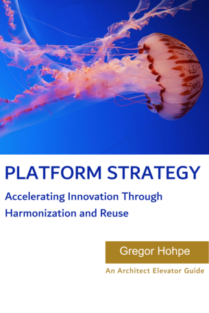

---

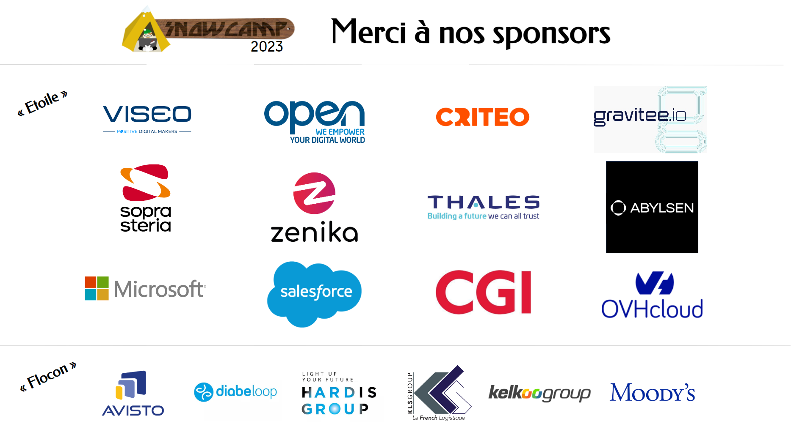

---

<!-- _class: titleslide -->

# Merci

## 🐤 @ojacques2 🐤 @angegar
     
