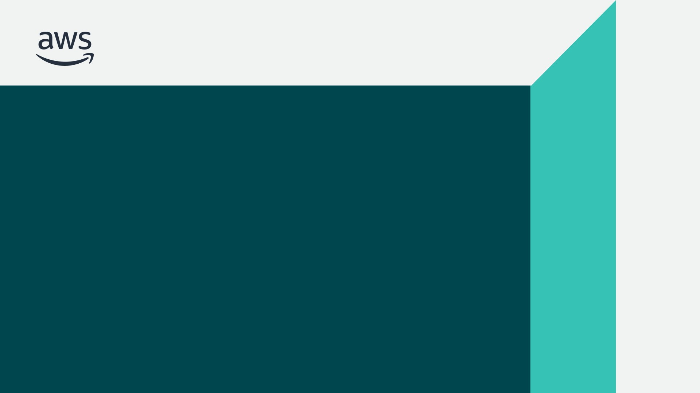
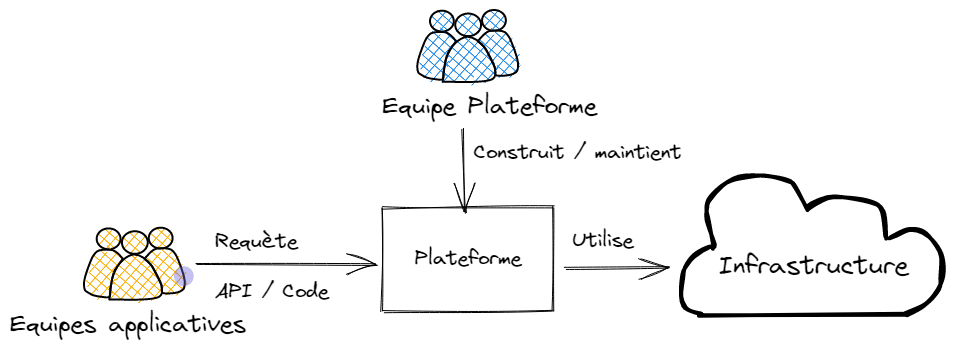
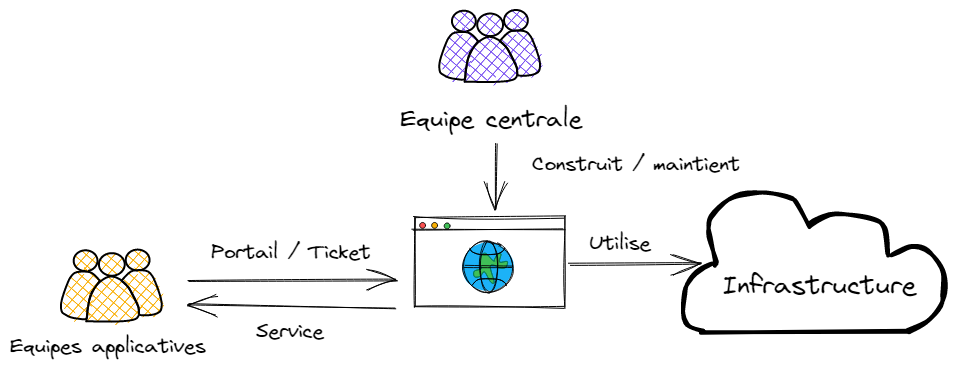

<!-- _class: titleslide -->

# Platform Engineering

## Lorsque Kubernetes devient la clé du royaume

## Snowcamp 2023

Laurent Gil - ATOS  
Olivier Jacques - AWS

<!--
Je m'appelle Olivier Jacques, je suis consultant DevOps senior à AWS ProServe. Je suis également membre de l'AWS User Group Grenoble.

<Laurent>

Laurent et moi, nous avons une bonne expérience de mise en place de plateformes. Nous avons notamment fortemment contribué à une plateforme d'entreprise qui a eu jusqu'à 30,000 utilisateurs: une plateforme complète de CI/CD.

Aujourd'hui, nous allons vous parler de plateformes. Pourquoi en créer, comment s'assurer qu'elles soient utilisées, comment les faire évoluer, et aussi une approche pour les construire en utilisant Kubernetes.
-->

---

<!--

Si vous êtes ici, c'est que le Platform Engineering vous intéresse. Et c'est vrai, Gartner a listé Platform Engineering comme l'une des tendances majeures pour 2023.

-->

---

# DevOps est ☠️ ?

## 🤴🐉🏰⚔️

<!--
Récemment, j'ai vu passer un (des) tweet(s) disant que DevOps était mort. Je ne sais pas si c'est vrai ou non, mais je sais que le DevOps n'est pas mort. Il est juste en train de changer.

Et comme la nature a horreur du vide, il faut bien que quelqu'un prenne le relais. Et nous parlerons donc de Platform Engineering.

Ou plutôt, c'est ce que certains disent. Car, comme nous allons vous le démontrer, le platform engineering ne remplace pas DevOps, mais le complète.

Essayons ici de faire le tri.
-->

---

# Conclusion

(oui, autant partir sur la conclusion)

- Non, DevOps n'est pas mort
- Le Platform Engineering permet d'accélérer l'innovation
- Kubernetes comme plateforme de base

---

<!-- _class: titleslide -->

       

# "You build it, you run it"
## 2016, Dr Werner Vogels, CTO AWS

<!-- 
Je voulais remettre ici cette citation de Dr Werner Vogels, CTO AWS. "You Build it, you run it". C'est important, car c'est comme cela que nous opérons à AWS. Cela dit, tout n'est pas dit dans ces 6 mots. Pour opérer ainsi, nous avons besoin de plateformes. Notre plateforme est bien évidemment AWS, avec ces plus de 200 services que nous pouvons assembler pour créer des solutions. Mais pas seulement. Nous avons aussi des plateformes construites au dessus d'AWS, par nos équipes, pour encore améliorer la productivité de nos équipes. Et c'est là que le Platform Engineering entre en jeu.
-->

---

<!-- _class: titleslide -->

# Les plateformes

<!--
Les plateformes ne sont pas nouvelles. Par exemple, dans le monde de l'automobile, les plateformes ont révolutionné la façon dont les constructeurs automobiles développent et commercialisent leurs véhicules.
Volkswagen a lancé sa plateforme MQB en 2012. Cette plateforme a permis à Volkswagen de réduire le temps de développement de ses véhicules de 30% et de réduire les coûts de développement de 20%.

Nous devons pouvoir utiliser ce concept dans le monde du cloud. Sauf que... voyons la suite.
-->

---

# Définition - Plateforme

> "Les plateformes sont un moyen de centraliser l'expertise, tout en décentralisant l'innovation au client ou l'utilisateur"

Peter Gillard-Moss, ThoughtWorks

---

## Définition - Platform Engineering

> "Le "Platform Engineering" concerne la création et la maintenance de plateformes informatiques pour héberger des applications et des services en ligne. Cette discipline vise à améliorer l'efficacité et la flexibilité des processus de développement et de déploiement de logiciels."

ChatGPT

---

## Définition - Platform Engineering

> "L'ingénierie des plates-formes est la discipline qui consiste à concevoir et à créer des chaînes d'outils et des flux de travail qui permettent aux organisations d'ingénierie logicielle de disposer de capacités en libre-service à l'ère du "cloud-native". Les ingénieurs de plate-forme fournissent un produit intégré, souvent appelé "plate-forme interne de développement", qui couvre les besoins opérationnels de l'ensemble du cycle de vie d'une application.

[Luca Galante](https://platformengineering.org/blog/what-is-platform-engineering)

---

## Une plateforme, des véhicules

- Nissan Cube
- Nissan Micra (K12)
- Renault Captur
- Renault Clio III
- Renault Clio IV[4]
- Renault Modus
- Renault Wind
- Renault Zoe
- Nissan Bluebird Sylphy (G11)
- ...

---

## Une platforme

- Fort investissement
- Standardisation

## Des produits

- Investissement minimums
- Usages diverses
- Différentientes

---

# Pourquoi construire une plateforme ?

- Réduire la charge cognitive
- Augmenter la productivité
- Forcer la standardisation

> Grandir les équipes, tout en préservant ce qui permet d'être productif: l'autonomie, avec un minimum de coordination et de l'infrastructure en self-service.

<!--
Les standards ne réduisent pas la créativité, mais ils la boostent. Se mettre d'accord sur certains standards permet de booster la créativité.
-->

---

---

<!-- _class: titleslide -->

# Reussir une plateforme

---

# Gérer sa plateforme comme un produit

- Un Product Owner: la vision, les besoins des utilisateurs
- Une équipe de développeurs
- une feuille de route
- des utilisateurs !

---

# Caractéristiques d'une bonne plateforme

- Facile à adopter
- Transparente dans sa gouvernance, son fonctionnement
- Responsabilité partagée (Inner Source)
- Non obligatoire

---

# ⚠️ Une plateforme n'est pas un service

Fournir une base de donnée "clé en main", n'est pas fournir une plateforme. C'est fournir un service.

---

# Un service

- Intéragit avec des tickets
- Responsabilité séparée
- Goulot d'étranglement
- Peu d'évolution
- Pas d'extension
- Pas le choix d'adopter ou pas le service.

---

# Construire une plateforme au dessus d'une autre

AWS, K8s.

---

---

# Kubernetes comme platforme framework

- Self service avec les Kubernetes API
- Extensible par nature avec les controllers et les définitions de ressource personnalisé
- Auto scale
- Auto heal
- Declarative approach
- Bénéficie d'un echo système très large permettant le monitoring, l'observabilité, la sécurité
- Permet de changer de paradigme de pipeline (push pipeline devient pull pipeline)
- **Un seul language/format pour gérer l'infrastructure et l'application (A développer)**
  
---

# Move from push pipelines to pull pipelines

- Adopter une approche défensive
- Amélioration de la sécurité avec des pipelines de type pull
- Utilisation d'outils GitOps (Flux, Rancher Fleet, ArgoCD)

---

# Gestion des permssions

- Simplification de la gestion des permissions des utilisateurs
- Simplification de la gestion des permissions dans les pipelines

---

# Qu'est ce qu'un controlleur Kubernetes

**Un controlleur traque un type de ressource définissant un état afin de modifier la plateforme pour atteindre l'état désiré.**

Et si les ressources étaient de type infrastructure ou encore de type interne à l'entreprise.

---

# Ressource de type infrastucture

Il existe actuellement plusieurs controlleurs kubernetes permettant de piloter des clouds.

- [Crossplane](https://www.crossplane.io/)
- [AWS ACK Controller](https://aws.amazon.com/fr/blogs/containers/aws-controllers-for-kubernetes-ack/)
- [GCP Config Connector](https://cloud.google.com/config-connector/docs/overview)

---

# Enforce compliance with company policies

- OPA Gatekeeper
- Validating webhook
- Mutating webhook

---

Developers should be able to deploy and run their apps and services end to end. “You build it, you run it”. True DevOps.

---

<!-- _class: titleslide -->

# Merci

🐤 @ojacques2 @angegar
