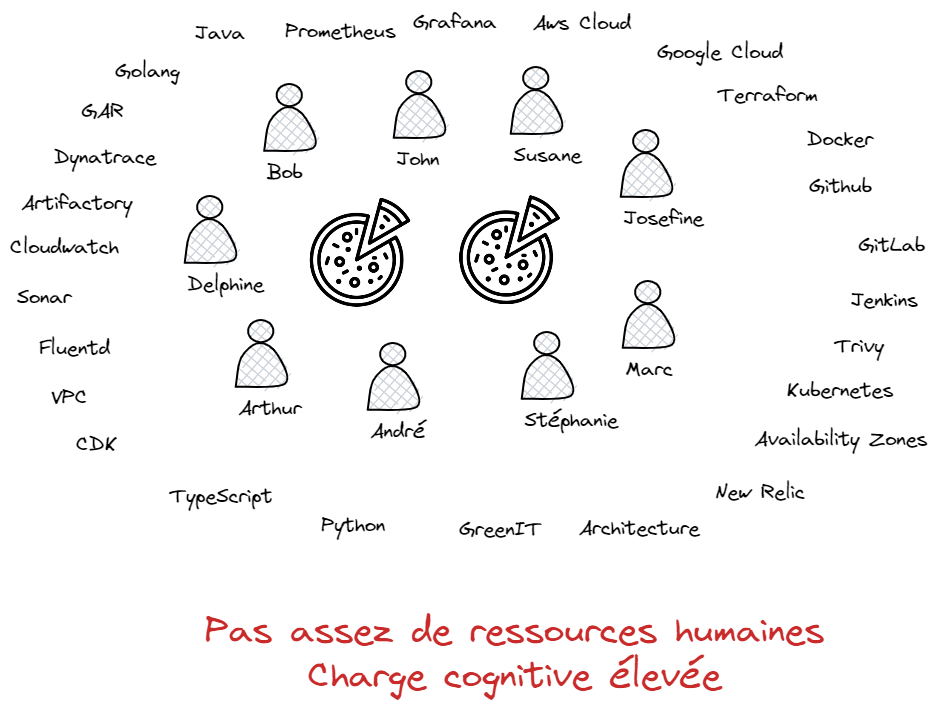
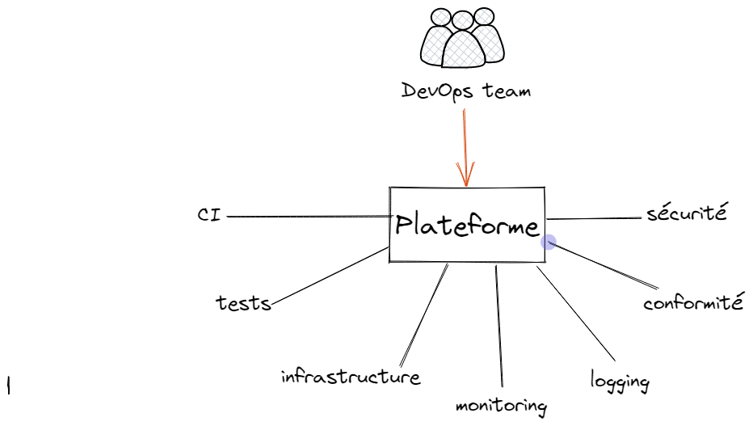
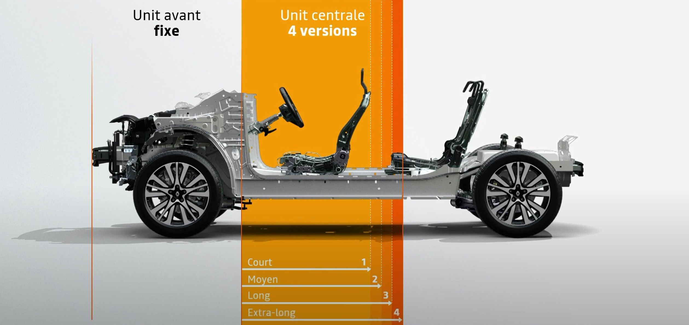
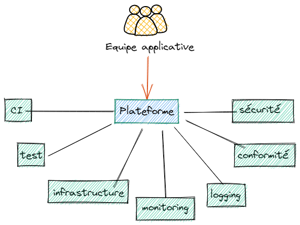

# 👋

<!-- markdown-link-check-disable -->
## [Laurent GIL](https://www.linkedin.com/in/laurent-gil/?locale=en_US)
<!-- markdown-link-check-enable -->

DevOps Coach,
AWS Solution Architect,
Kubernetes evangelist

<!-- markdown-link-check-disable -->
## [Olivier JACQUES](https://www.linkedin.com/in/olivierjacques/)
<!-- markdown-link-check-enable -->

<!--
I am Laurent. I've been working at manomano for 5 years where I had several roles,
Lead Developer, QA, and now QE.
My goal is to reduce the friction and time wasted due to an ecosystem in order to improve the developer.experience.
-->

Sr Cloud & DevOps Architect
AWS

---

# Platform Engineering

## Lorsque Kubernetes devient la clé du royaume

## Snowcamp 2023

Laurent Gil - ATOS  
Olivier Jacques - AWS

<!--
Je m'appelle Olivier Jacques, je suis consultant DevOps senior à AWS ProServe. Je suis également membre de l'AWS User Group Grenoble.

<Laurent>

Laurent et moi, nous avons une bonne expérience de mise en place de plateformes. Nous avons notamment fortemment contribué à une plateforme d'entreprise qui a eu jusqu'à 30,000 utilisateurs: une plateforme complète de CI/CD.

Aujourd'hui, nous allons vous parler de plateformes. Pourquoi en créer, comment s'assurer qu'elles soient utilisées, comment les faire évoluer, et aussi une approche pour les construire en utilisant Kubernetes.
-->

---

<!--

Si vous êtes ici, c'est que le Platform Engineering vous intéresse. Et c'est vrai, Gartner a listé Platform Engineering comme l'une des tendances majeures pour 2023.

-->

---

# DevOps est ☠️ ?

## 🤴🐉🏰⚔️

<!--
Récemment, j'ai vu passer un (des) tweet(s) disant que DevOps était mort. Je ne sais pas si c'est vrai ou non, mais je sais que le DevOps n'est pas mort. Il est juste en train de changer.

Et comme la nature a horreur du vide, il faut bien que quelqu'un prenne le relais. Et nous parlerons donc de Platform Engineering.

Ou plutôt, c'est ce que certains disent. Car, comme nous allons vous le démontrer, le platform engineering ne remplace pas DevOps, mais le complète.

Essayons ici de faire le tri.
-->

---

# Conclusion

(oui, autant partir sur la conclusion)

- Non, DevOps n'est pas mort
- Le Platform Engineering permet d'accélérer l'innovation
- Kubernetes comme plateforme de base

---

<!-- _class: titleslide -->

       

# "You build it, you run it"
## 2016, Dr Werner Vogels, CTO AWS

<!-- 
Je voulais remettre ici cette citation de Dr Werner Vogels, CTO AWS. "You Build it, you run it". C'est important, car c'est comme cela que nous opérons à AWS. Cela dit, tout n'est pas dit dans ces 6 mots. Pour opérer ainsi, nous avons besoin de plateformes. Notre plateforme est bien évidemment AWS, avec ces plus de 200 services que nous pouvons assembler pour créer des solutions. Mais pas seulement. Nous avons aussi des plateformes construites au dessus d'AWS, par nos équipes, pour encore améliorer la productivité de nos équipes. Et c'est là que le Platform Engineering entre en jeu.
-->

---

# Build it, Ship it, Run it

---

# 2 pizzas pour une équipe

---

# Solution ?

---

# Les plateformes

<!--
Les plateformes ne sont pas nouvelles. Par exemple, dans le monde de l'automobile, les plateformes ont révolutionné la façon dont les constructeurs automobiles développent et commercialisent leurs véhicules.
Volkswagen a lancé sa plateforme MQB en 2012. Cette plateforme a permis à Volkswagen de réduire le temps de développement de ses véhicules de 30% et de réduire les coûts de développement de 20%.

Nous devons pouvoir utiliser ce concept dans le monde du cloud. Sauf que... voyons la suite.
-->

---

# Définition - Plateforme

> "Les plateformes sont un moyen de centraliser l'expertise, tout en décentralisant l'innovation au client ou l'utilisateur"

Peter Gillard-Moss, ThoughtWorks

---

## Définition 1 - Platform Engineering

> "Le "Platform Engineering" concerne la création et la maintenance de plateformes informatiques pour héberger des applications et des services en ligne. Cette discipline vise à améliorer l'efficacité et la flexibilité des processus de développement et de déploiement de logiciels."

ChatGPT

---

## Définition 2 - Platform Engineering

> "L'ingénierie des plateformes est la discipline qui consiste à concevoir et à créer des chaînes d'outils et des flux de travail qui permettent aux organisations d'ingénierie logicielle de disposer de capacités en libre-service à l'ère du "cloud-native". Les ingénieurs de plateforme fournissent un produit intégré, souvent appelé "plateforme interne de développement", qui couvre les besoins opérationnels de l'ensemble du cycle de vie d'une application.

[Luca Galante](https://platformengineering.org/blog/what-is-platform-engineering)

---

## Une plateforme, des véhicules

- Nissan Cube
- Nissan Micra (K12)
- Renault Captur
- Renault Clio III
- Renault Clio IV[4]
- Renault Modus
- Renault Wind
- Renault Zoe
- Nissan Bluebird Sylphy (G11)
- ...

---

## Une plateforme

- Fort investissement
- Standardisation

## Des produits

- Investissement minimums
- Usages diverses
- Différentientes

---

# Pourquoi construire une plateforme ?

- Réduire la charge cognitive
- Augmenter la productivité
- Forcer la standardisation

> Grandir les équipes, tout en préservant ce qui permet d'être productif: l'autonomie, avec un minimum de coordination et de l'infrastructure en self-service.

<!--
Les standards ne réduisent pas la créativité, mais ils la boostent. Se mettre d'accord sur certains standards permet de booster la créativité.
-->

---

---

# Réussir une plateforme

---

# Caractéristiques d'une bonne plateforme

- Facile à adopter
- Transparente dans sa gouvernance, son fonctionnement
- Responsabilité partagée (Inner Source)
- Flexible et extensible

---

# ⚠️ Une plateforme n'est pas un service

Fournir une base de donnée "clé en main", n'est pas fournir une plateforme. C'est fournir un service.

---

# Un service

- Intéragit avec des tickets
- Responsabilité séparée
- Goulot d'étranglement
- Peu d'évolution
- Pas d'extension
- Pas le choix d'adopter ou pas le service.

---

# Construire une plateforme au dessus d'une autre

## AWS, Kubernetes

---

# Une implémentation à base de Kubernetes

---

# A propos de Kubernetes

📖 Kubernetes est une plate-forme open-source extensible et portable pour la gestion de charges de travail (workloads) et de services conteneurisés📖

📖 Kubernetes a également été conçu pour servir de plate-forme et favoriser la construction d’un écosystème de composants et d’outils facilitant le déploiement, la mise à l’échelle et la gestion des applications.📖

[source](https://kubernetes.io/fr/docs/concepts/overview/what-is-kubernetes/)

---

# Kubernetes comme plateforme framework

- Self service avec les Kubernetes API extensibles
- Une approche déclarative
- Bénéficie d'un écosystème très large permettant le monitoring, l'observabilité, la sécurité
!!!! - Permet de changer le paradigme de pipeline (push pipeline devient pull pipeline) !!!!
- Extensible par nature avec les controlleurs et les définitions de ressource personnalisé
- Robustness and self-healing

---

# Qu'est ce qu'un controlleur Kubernetes

**Un controlleur traque un type de ressource définissant un état afin de modifier la plateforme pour atteindre l'état désiré.**

Et si les ressources étaient de type infrastructure ou encore des applications internes à l'entreprise.

---

# As CI / CD plateform

- Run CI
  - JenkinsX /
  - Tekton
- Run CD
  - ArgoCD
  - Flux

---

# Comme plateforme de test

- kubernetes cluster virtuel (nodes et network partagés entre cluster physique et virtuel)
- Créer et détruire des environnements de teste à la volée

---

# Pour gérer l'infrastructure

## Ressource de type infrastucture

- [Crossplane](https://www.crossplane.io/)
- [AWS ACK Controller](https://aws.amazon.com/fr/blogs/containers/aws-controllers-for-kubernetes-ack/)
- [GCP Config Connector](https://cloud.google.com/config-connector/docs/overview)

## Resource de type interne à l'entreprise

- Créer des définitions de ressource personnalisées
- Créer des controlleurs personnalisées permettant de piloter des outils internes
<!--(ex: renseigner une base de référence d'application à partir de resources de type déploiment) -->

---

# Monitoring des applications

- [Grafana](https://github.com/grafana/grafana)
- [Dynatrace](https://www.dynatrace.com/)
- [Datadog](https://www.datadoghq.com/)

---

# Collecter les log de manière centrale

- [Fluentd](https://github.com/fluent/fluentd)
- [Loggie](https://github.com/loggie-io/loggie)

---

# Gestion centralisée de la conformité

<!-- Réalisé au niveau de l'API via des webhooks -->

Instrumenter la stack Kubernetes pour forcer la conformité :

- [OPA Gatekeeper](https://github.com/open-policy-agent/gatekeeper) ([policy library](https://open-policy-agent.github.io/gatekeeper-library/website/allowedrepos))

- [Kyverno](https://github.com/kyverno/kyverno) ([policy library](https://kyverno.io/policies/?policytypes=Deployment))

---

# Gestion centralisée de la sécurité

- [KubeArmor](https://github.com/kubearmor/kubearmor) : at the system level
- [Trivy-Operator](https://github.com/aquasecurity/trivy-operator)
  
---

# Les bénéfices

---

# Opérabilité

- Une seul language pour gérer une multitude de problèmes (infrastructure, application, monitoring ...)
- Une CLI commune à toutes les applications pour la recherche de problèmes
- Des services standards utilisés par toutes les équipes

---

# Améliorer le temps de reprise après sinistre

## Habituellement

<!-- 
- Cycle de vie infra séparé du cycle de vie de l'application
- Packagé séparément
- Utilise des languages différents => charge cognitive
- Dépendance entre pipeline (ex: storage, database, DNS,...)
 -->

- un pipeline pour l'infrastructure
- un pipeline pour l'applications

## Avec Kubernetes comme plateforme

<!--
- K8s et sa capacité à être étendu via des controlleurs
  résoud ces problèmes.

-->

- un pipeline pour déployer les **manifestes d'infrastructure et d'application** en parallèle.
- atomicité du déploiement (application + infrastructure)
- **universal control plane**

---

# Move from push pipelines to pull pipelines

<!--
- sécurité:
-   Sur un pipeline push les agents de l'orchestrateur ont souvent des droits étendus. Sur un pipeline pull, c'est l'environnement cible qui a des droits sur la CI.
- Pipeline push scale mal à travers plusieurs clusters
- YAML syntax permet d'utiliser le patterne app of app, ce qui permet de démarrer tout un cluster à partir d'un application bootstrap (mettre un example argocd)
-->

- Amélioration de la sécurité
- Scalabilité des chaînes de déploiement
- Utilisation d'**outils GitOps** (Flux, Rancher Fleet, ArgoCD)

---

# Gestion des permissions

- Simplification de la gestion des permissions des utilisateurs
- Simplification de la gestion des permissions dans les pipelines

---

Developers should be able to deploy and run their apps and services end to end. “You build it, you run it”. True DevOps.

---

# Littérature
               

---

# Merci

🐤 @ojacques2 @angegar

---

DevOps => Build it run it ship => problèmes => les PIZZA teams ne sont pas taillésp pour résoudre tous les problèmes d'opérations, d'infrastructure de compliance en plus de leur développement (CHARGE COGNITIVE) => Platform Engineering

- Une plateforme commune et un langage commun pour les équipes DevOps et l'équipe Plateform Engineering (Infrastructure)

- authentification
- authorization
- fournit des services de base:
  - monitoring
